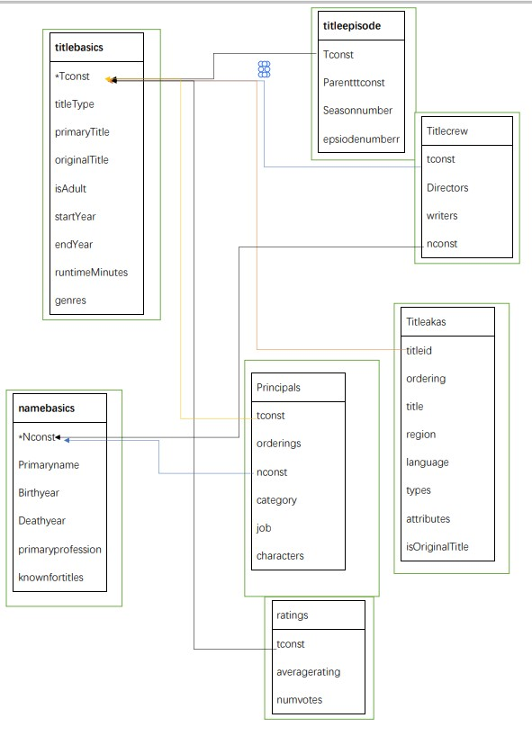

# databaseproject
    模仿IMDB的影片管理系统(IMDb Datasets (http://www.imdb.com/interfaces );)
## **各个数据表**：
 * Namebasics表，存储人员相关信息，包括人员id（nconst），姓名，出生死亡年份，主要工作，成名作
 * Titlebasics表，存储影片相关信息，包括影片ID（tconst），标题类型，标题，原名，是否为成人级，上映下映年份，时长，种类
 * Titleepisode表，包含影片ID，集数ID，季数，集数
 * Titlecrew表，包含影片ID，导演，编剧，人物ID
 * Titleakas表，包含影片ID，顺序，标题，地区，语言，类型，属性，是否原名
 * Ratings表，包含影片ID，平均评分，参评人数
 * Principals表，包含影片ID，顺序，人物ID，种类，工作，扮演角色
 
##E-R图:
* 
